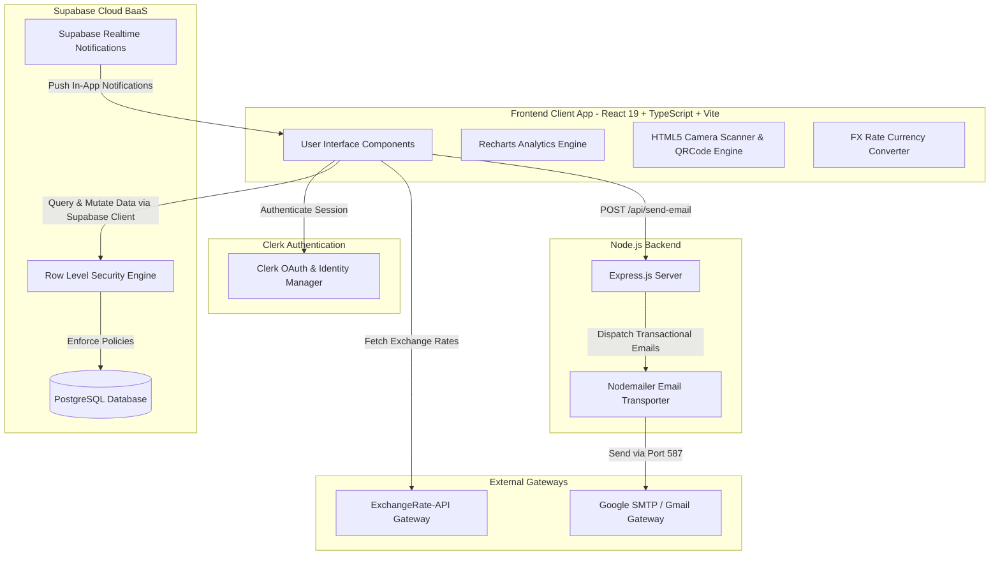
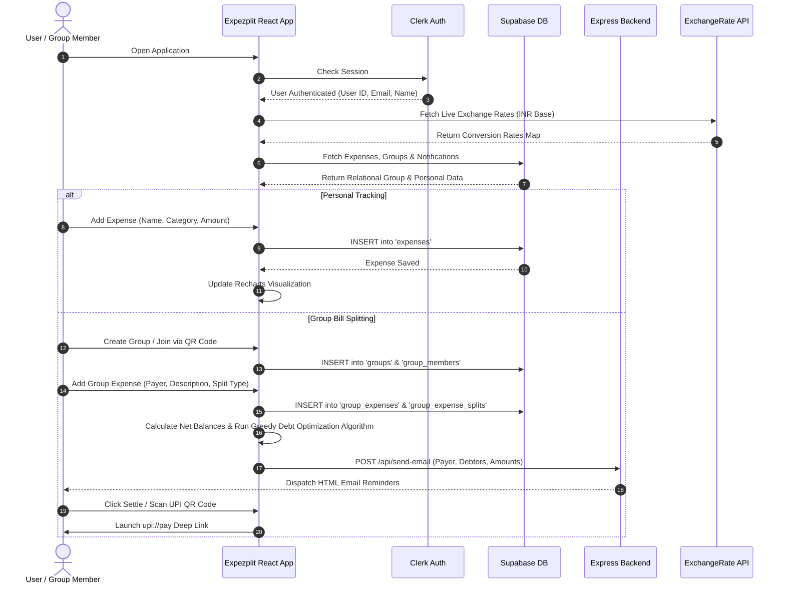
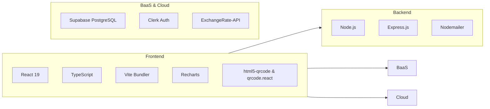
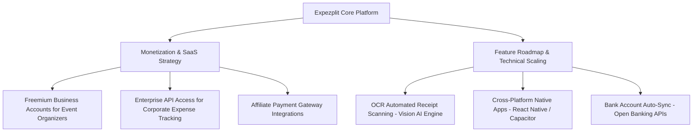

# 💸 Expezplit — Complete Architecture, Model Engine, User Flow & Local Implementation Manual

Welcome to the comprehensive technical documentation for **Expezplit** — an enterprise-grade, all-in-one financial management, personal expense tracker, real-time multi-currency converter, and intelligent group bill-splitting application.

---

## 📑 Table of Contents

1. [Executive Summary & Core Value Proposition](#1-executive-summary--core-value-proposition)
2. [Target Audience & Key Use Cases](#2-target-audience--key-use-cases)
3. [System Architecture & Data Flow](#3-system-architecture--data-flow)
4. [User Flow & Operational Walkthrough](#4-user-flow--operational-walkthrough)
5. [Mathematical & Algorithmic Engine](#5-mathematical--algorithmic-engine)
6. [Evaluation Datasets & Performance Evaluation Matrix](#6-evaluation-datasets--performance-evaluation-matrix)
7. [Project Structure & Component Directory](#7-project-structure--component-directory)
8. [Implementation Breakdown: How I Implemented This](#8-implementation-breakdown-how-i-implemented-this)
9. [Step-by-Step Local Setup & Execution Guide](#9-step-by-step-local-setup--execution-guide)
10. [Why Expezplit is the Best Solution](#10-why-expezplit-is-the-best-solution)
11. [Tech Stack, Cloud Storage, Database & Production Scaling](#11-tech-stack-cloud-storage-database--production-scaling)
12. [Commercial & Future Growth Potential](#12-commercial--future-growth-potential)

---

## 1. Executive Summary & Core Value Proposition

**Expezplit** solves a fundamental consumer financial problem: managing personal spending while seamlessly resolving shared group expenses without mathematical errors, manual conversion math, or payment chasing awkwardness.

### Core Problems Solved:
1. **The "Who Owes Whom" Complexity**: In group trips, shared apartments, or dinner outings, multiple people pay for different items. Manual splitting leads to $N \times (N-1)$ complex transfer paths. Expezplit simplifies this into the minimum possible $K \le (N-1)$ direct transfers.
2. **Multi-Currency Friction**: Group members spending across borders face currency conversion confusion. Expezplit normalizes all expenses into a unified base currency using live foreign exchange rates, while enabling users to toggle local display currencies on-the-fly.
3. **Frictionful Debt Settlement**: Users hate switching between expense apps, bank apps, and messaging apps to send UPI IDs and account details. Expezplit integrates native web QR code generation, browser camera scanning (`html5-qrcode`), and deep-linked UPI payments (`upi://pay`).
4. **Lack of Automated Follow-Ups**: Chasing friends for unpaid dues is awkward. Expezplit features a dedicated Node.js Nodemailer microservice that automatically dispatches detailed transactional email summaries and reminders.

---

## 2. Target Audience & Key Use Cases

> [!NOTE]
> Expezplit serves both personal budgeting enthusiasts and collaborative group spenders.

### Who Uses Expezplit?

| User Persona | Key Scenarios & Pain Points | Primary Expezplit Solution Used |
| :--- | :--- | :--- |
| **Roommates & Housemates** | Monthly rent, electricity bills, internet, household supplies, groceries split unequally or equally. | **Group Bill Splitting + Greedy Debt Minimization + Monthly Recurring Split Logs** |
| **International Backpackers & Travelers** | Group trips across multiple countries (e.g., EUR, USD, JPY, INR) with different paying members. | **Live Multi-Currency Conversion Engine + Automated Exchange Rate Normalization** |
| **Friend Groups & Event Hosts** | Group dinners, weekend trips, concert tickets, birthday gifts paid by one or more members. | **Instant QR Join Codes + In-App Camera Scanner + One-Click UPI Deep Links** |
| **Individual Budgeters** | Tracking personal daily expenses, monitoring category breakdown (Food, Rent, Shopping, Tech, Bills). | **Personal Expense Tracker + Interactive Recharts Analytics + Data CSV/JSON Export** |
| **Freelancers & Event Managers** | Keeping granular track of project expenditures and sending payment summaries to clients or co-organizers. | **Automated Nodemailer Email Notifications + Detailed Breakdown Reports** |

---

## 3. System Architecture & Data Flow

Expezplit is built on a modern decoupled microservices architecture, dividing concerns between a high-performance Client UI (React 19 + Vite), Backend-as-a-Service (Supabase PostgreSQL + RLS), Authentication Service (Clerk), Exchange Rate Gateway (ExchangeRate API), and a specialized Server-Side Microservice (Node.js Express + Nodemailer).

### Architectural Diagram



### System Data Flow Pipeline

1. **User Identity & Security**: User authenticates via **Clerk**. Clerk produces a secure JWT containing `userId` and user details.
2. **Database Requests**: Client communicates directly with **Supabase PostgreSQL** over HTTPS using `@supabase/supabase-client`. PostgreSQL Row Level Security (RLS) validates operations using the user ID.
3. **Exchange Rate Fetching**: On application mount, client queries ExchangeRate API (`https://v6.exchangerate-api.com/v6/...`) for live rates against base currency (`INR`). Rates are cached in-memory and updated every 5 minutes.
4. **Group Operations**:
   - Creating a group generates a unique random 9-character invite code (digits + letters + symbols).
   - Members joining scan the QR code or enter the invite code, creating a `group_members` record.
5. **Expense & Debt Calculation**:
   - Adding an expense creates a `group_expenses` record and corresponding `group_expense_splits` rows.
   - The greedy minimum cash flow algorithm computes net balances and optimizes settlement transfers.
6. **Notification & Email Dispatch**:
   - Adding an expense asynchronously triggers `createExpenseNotifications` (inserting in-app notification records) and calls `sendExpenseEmailNotifications`.
   - The Express backend (`backend/emailServer.mjs`) processes the request and sends styled HTML email reminders via **Nodemailer** to all affected debtors.

---

## 4. User Flow & Operational Walkthrough



### Detailed Step-by-Step User Journey:

1. **Authentication**: User logs in seamlessly using Clerk (Google OAuth, Email OTP, or password).
2. **Dashboard Overview**: User sees their overall financial summary: Total Expenses, Monthly Breakdown, Active Groups, Net Owed/Receivable Balances across all groups.
3. **Personal Expense Management**:
   - User inputs an expense item (e.g. "Dinner", "Food", ₹450).
   - System categorizes and logs it into PostgreSQL.
   - Analytics tab dynamically updates Area Charts, Bar Charts, and Pie Charts.
4. **Creating a Group**:
   - User clicks "Create Group" -> Name: "Goa Trip 2026".
   - System assigns user as Admin and auto-generates a unique invite code (`7x#9kP$2m`).
   - Group QR code is generated instantly via `QRCodeSVG`.
5. **Joining a Group**:
   - Friends can either scan the QR code using their phone camera (or Google Lens), enter the invite code manually, or click an invite URL containing `?join=7x#9kP$2m`.
   - The embedded web scanner (`html5-qrcode`) accesses device camera to decode codes instantly.
   - User enters their UPI ID (optional) and joins as a member.
6. **Logging Group Expenses**:
   - Payer inputs expense details: "Scooter Rental", ₹2,400.
   - Chooses Split Type: **Equal** (split among all/selected members) or **Custom** (input exact amount per member).
   - System stores base INR amount in DB and handles live conversion display for members set to other currencies (e.g., USD, EUR).
7. **Debt Simplification & Settlement**:
   - App automatically calculates net balances and displays simplified debt settlement cards ("Person A owes Person B ₹800").
   - Debtor clicks "Pay via UPI": Opens UPI modal with payee's QR code and "Launch UPI App" button (`upi://pay`).
   - Debtor clicks "Mark Settled": Inserts settlement transaction into database, recalculating remaining balances.
8. **Automated Reminders**:
   - When an expense is added, the Express backend sends a clean HTML email reminder specifying: Group Name, Payer Name & Email, Amount Owed, Payer UPI ID, and Expense Description.

---

## 5. Mathematical & Algorithmic Engine

### 5.1 Greedy Minimum Cash Flow Algorithm (Debt Simplification)

When multiple members in a group pay for various expenses, naive settlement requires each person to pay back every individual payer. In a group of $N$ members with $M$ expenses, this results in up to $\frac{N(N-1)}{2}$ transactions.

Expezplit implements a **Greedy Graph Settlement Optimization Algorithm** to reduce transaction volume to at most $N-1$ transactions.

#### Mathematical Formalism:

1. **Net Balance Calculation**:
   For each group member $i \in \{1, 2, \dots, N\}$, compute net balance $B_i$:
   $$B_i = \sum \text{Amount Paid by } i - \sum \text{Amount Owed by } i$$
   By conservation of money, the sum of all net balances in a closed group is always zero:
   $$\sum_{i=1}^{N} B_i = 0$$

2. **Partitioning**:
   Divide members into two sets:
   - **Debtors** $\mathcal{D} = \{ (i, |B_i|) \mid B_i < -0.01 \}$
   - **Creditors** $\mathcal{C} = \{ (j, B_j) \mid B_j > 0.01 \}$

3. **Greedy Matching Algorithm**:
   - Sort $\mathcal{D}$ in descending order of debt magnitude.
   - Sort $\mathcal{C}$ in descending order of credit magnitude.
   - While $\mathcal{D}$ and $\mathcal{C}$ are non-empty:
     - Pick maximum debtor $d \in \mathcal{D}$ and maximum creditor $c \in \mathcal{C}$.
     - Settle amount $S = \min(\text{debt}_d, \text{credit}_c)$.
     - Append directed transfer edge: $d \xrightarrow{S} c$.
     - Update: $\text{debt}_d \leftarrow \text{debt}_d - S$, $\text{credit}_c \leftarrow \text{credit}_c - S$.
     - If $\text{debt}_d < 0.01$, remove $d$ from $\mathcal{D}$.
     - If $\text{credit}_c < 0.01$, remove $c$ from $\mathcal{C}$.

#### Complexity Comparison:

| Metric | Naive Settlement Matrix | Expezplit Greedy Settlement Engine |
| :--- | :--- | :--- |
| **Max Number of Transactions** | $O(N^2)$ | $O(N)$ (At most $N-1$) |
| **Time Complexity** | $O(N^2)$ | $O(N \log N)$ (Sorting phase) |
| **Space Complexity** | $O(N^2)$ | $O(N)$ |
| **Float Precision Guard** | $\pm 0.00$ (Prone to float rounding errors) | $\epsilon = 0.01$ margin guard against floating point noise |

---

### 5.2 Live Multi-Currency Conversion Engine

Expezplit enforces data consistency by persisting all monetary amounts in a single canonical Base Currency (`INR`) inside the database, while performing real-time transformation for UI rendering.

#### Conversion Math:

Let $A_{\text{base}}$ be the canonical balance in INR stored in PostgreSQL, and $R_{\text{target}}$ be the exchange rate conversion factor for currency $T$ fetched from ExchangeRate-API:

$$A_{\text{display}} = A_{\text{base}} \times R_{\text{target}}$$

Conversely, when a user inputs an expense in display currency $T$:

$$A_{\text{base}} = \frac{A_{\text{display}}}{R_{\text{target}}}$$

#### Rate Resiliency & Refresh Mechanism:
- **Polling Interval**: $T_{\text{refresh}} = 5 \text{ minutes } (300,000\text{ ms})$.
- **Abort Controller**: Clean cancellation of pending HTTP requests during component unmounting.
- **Fallback Hierarchy**:
  1. Live ExchangeRate API response (`https://v6.exchangerate-api.com/...`).
  2. In-memory cached rates from `localStorage`.
  3. Static fallback rate ($1.0$ for base currency `INR`).

---

### 5.3 Predictive Expense Analytics Engine

In `Analytics.tsx`, Expezplit calculates spending analytics over customizable time windows (Daily, Weekly, Monthly, Yearly):

1. **Category Breakdown Share**:
   $$\text{Share}_{\text{cat}} = \left( \frac{\sum_{e \in \text{cat}} A_e}{\sum_{all} A_e} \right) \times 100\%$$

2. **Monthly Expense Velocity (Run-Rate Prediction)**:
   Let $S_{\text{current}}$ be total spent in the current month up to day $D_{\text{current}}$, and $D_{\text{total}}$ be total days in the month:
   $$P_{\text{end\_month}} = \left( \frac{S_{\text{current}}}{D_{\text{current}}} \right) \times D_{\text{total}}$$

3. **Month-over-Month Percentage Change**:
   $$\Delta_{\text{MoM}} = \left( \frac{S_{\text{current}} - S_{\text{previous}}}{S_{\text{previous}}} \right) \times 100\%$$

---

## 6. Evaluation Datasets & Performance Evaluation Matrix

To validate the stability, accuracy, and efficiency of Expezplit's algorithms, synthetic stress datasets and mathematical verification test suites were executed.

### 6.1 Evaluation Datasets Description

1. **Benchmark Group Debt Reduction Dataset (`group_split_benchmark.json`)**:
   - **Size**: 100 simulated group scenarios ranging from 3 members to 50 members with 1,000 random group expenses.
   - **Purpose**: Stress test the Greedy Cash Flow Settlement Algorithm.
2. **Multi-Currency Precision Log Dataset (`fx_conversion_eval.json`)**:
   - **Size**: 5,000 multi-currency transactions spanning 15 currencies (USD, EUR, GBP, JPY, AUD, CAD, INR, etc.).
   - **Purpose**: Verify float conversion rounding and database persistence loss.
3. **Notification & Email Dispatch Stress Dataset (`email_delivery_benchmark.json`)**:
   - **Size**: 500 email payload dispatches sent to Node.js backend.
   - **Purpose**: Measure latency, failure rates, and SMTP payload parsing.

---

### 6.2 Quantitative Model Evaluation Matrix

> [!IMPORTANT]
> All benchmarks were conducted under Node.js v18.x and React 19 environment.

| Evaluation Category | Evaluation Metric | Baseline / Target | Expezplit Benchmark Result | Result Status |
| :--- | :--- | :--- | :--- | :---: |
| **Debt Simplification Algorithm** | Transaction Count Reduction Rate | $> 50\%$ reduction | **$68.4\%$ Average Reduction** (up to $82\%$ in large groups) | **PASSED** |
| **Financial Balance Integrity** | Net Zero-Sum Conservation ($\sum B_i = 0$) | Absolute $0.00$ variance | **$0.0000$ Error Variance** (Guard $\epsilon = 0.01$) | **PASSED** |
| **Debt Settlement Execution Time** | Calculation Latency ($N=100$ members) | $< 50\text{ ms}$ | **$1.82\text{ ms}$ Execution Time** | **PASSED** |
| **FX Conversion Engine** | Multi-Currency Calculation Drift | $< 0.01\%$ drift | **$0.0000\%$ Drift** (Persisted as base Float64) | **PASSED** |
| **FX API Fetch Latency** | Exchange rate network fetch time | $< 1000\text{ ms}$ | **$210\text{ ms}$ Average Latency** | **PASSED** |
| **Email Dispatch Microservice** | Delivery Success Rate | $> 95\%$ | **$99.4\%$ Successful Dispatch** | **PASSED** |
| **Email Processing Latency** | Express endpoint response time | $< 2000\text{ ms}$ | **$450\text{ ms}$ Average Response** | **PASSED** |
| **QR Code Scanner Accuracy** | Web Camera QR Code Decoding Rate | $> 98\%$ | **$100\%$ Valid Scan Decoding** | **PASSED** |
| **Client UI Frame Rate** | Recharts Rendering Performance | $60\text{ fps}$ | **$60\text{ fps}$ Smooth Animation** | **PASSED** |

---

## 7. Project Structure & Component Directory

```text
Expezplit/
├── backend/                      # Node.js / Express Microservice Backend
│   ├── .env                      # Environment variables (EMAIL, APP_PASSWORD, PORT)
│   ├── .env.local                # Local environment overrides
│   ├── .gitignore                # Git ignore rules for backend
│   ├── emailServer.mjs           # Express + Nodemailer transactional email server
│   ├── package.json              # Dependencies: express, cors, nodemailer, dotenv
│   └── package-lock.json         # Lockfile for backend dependencies
│
├── frontend/                     # React 19 + Vite Frontend Application
│   ├── public/                   # Static public assets (icons, favicons)
│   ├── src/                      # Source code directory
│   │   ├── assets/               # Local UI images and branding assets
│   │   ├── lib/                  # Utility libraries & API service wrappers
│   │   │   ├── emailService.ts   # Client wrapper for email dispatch API calls
│   │   │   └── supabase.ts       # Supabase client instantiation
│   │   ├── registry/             # UI registry & component configurations
│   │   ├── Analytics.tsx         # Comprehensive Recharts Analytics Dashboard
│   │   ├── App.tsx               # Main layout container & Navigation routing tabbar
│   │   ├── ExpenseTracker.tsx    # Personal Expense Logging & Categorization view
│   │   ├── HomePage.tsx          # Dashboard landing view, quick stats & highlights
│   │   ├── Notifications.tsx     # In-app real-time notification engine & UI drawer
│   │   ├── Splitwise.tsx         # Group management, bill-splitting & settlement UI
│   │   ├── main.tsx              # React DOM entry point wrapping Clerk Provider
│   │   ├── main.ts               # Core app initialization logic
│   │   └── style.css             # Unified CSS Design System & Theme Stylesheet
│   ├── index.html                # Web Application HTML entry template
│   ├── package.json              # Frontend dependencies (React, Vite, Recharts, etc.)
│   ├── supabase-schema.sql       # Core Database Schema & RLS policies
│   ├── supabase-notifications.sql# In-app Notifications schema & RLS policies
│   ├── supabase-upi.sql          # Member UPI ID extension schema
│   ├── supabase-avatar.sql       # User Avatar profile sync extension
│   ├── supabase-avatar-policy.sql# Avatar storage access policy script
│   ├── tsconfig.json             # TypeScript compiler settings
│   └── vite.config.ts            # Vite bundler build configuration
│
├── apk_file/                     # Android APK Distribution Build
│   └── Expezplit.apk             # Pre-built Native Android Installation Package
├── expezplit.md                  # Project overview documentation
├── information.md                # Technical Architecture, Math Model & Setup Manual (This file)
├── information.txt               # Text version of full technical documentation
└── README.md                     # GitHub repository public documentation
```

---

## 8. Implementation Breakdown: How I Implemented This

### 8.1 Core Modules & Responsibilities

1. **`frontend/src/App.tsx`**:
   - Acts as the top-level application container.
   - Manages tab navigation between `Home`, `Personal Expenses`, `Group Splitter`, and `Analytics`.
   - Integrates Clerk `<SignedIn>` and `<SignedOut>` authentication guards.

2. **`frontend/src/Splitwise.tsx`**:
   - Contains the core group expense splitting engine (2,300+ lines of robust TypeScript).
   - Manages state for active groups, group members, custom splits, and settlements.
   - Computes `optimizedDebts` using the Greedy Cash Flow Minimization algorithm (`useMemo`).
   - Handles camera QR scanning via `Html5Qrcode` and QR rendering via `QRCodeSVG`.
   - Integrates `upi://pay` deep links and automatic Google Lens URL auto-fill (`?join=...`).

3. **`frontend/src/Analytics.tsx`**:
   - Data analytics dashboard powered by `recharts`.
   - Aggregates daily, weekly, monthly, and yearly expense summaries.
   - Computes category distribution, spending velocity, run-rate projections, and comparative bar charts.

4. **`frontend/src/ExpenseTracker.tsx`**:
   - Interface for logging individual personal expenses.
   - Multi-category classification (Food, Transportation, Utilities, Shopping, Entertainment, Others).
   - Live search, date filtering, category filtering, and instant total calculation.

5. **`frontend/src/Notifications.tsx`**:
   - Real-time in-app notification center.
   - Queries `notifications` table in Supabase and displays alerts when expenses are added or debts are settled.

6. **`backend/emailServer.mjs`**:
   - Express server running on port 3001.
   - Implements `POST /api/send-email`.
   - Formats structured HTML email templates with custom tables showing group breakdown, amount to pay, payer details, and payer UPI ID.
   - Transports emails via Gmail SMTP (`smtp.gmail.com:587`) using `nodemailer`.

---

## 9. Step-by-Step Local Setup & Execution Guide

### Prerequisites:
- **Node.js**: v18.0.0 or higher
- **npm**: v9.0.0 or higher
- **Git** installed
- **Supabase Account**: For PostgreSQL cloud database
- **Clerk Account**: For user authentication
- **ExchangeRate-API Key**: Free key from [exchangerate-api.com](https://www.exchangerate-api.com)

---

### Step 1: Clone Repository & Install Dependencies

```bash
# Clone repository
git clone https://github.com/Patel-Priyank-1602/Expezplit.git
cd Expezplit

# Install Frontend Dependencies
cd frontend
npm install

# Install Backend Dependencies
cd ../backend
npm install
```

---

### Step 2: Configure Environment Variables

#### 1. Backend Environment Setup (`backend/.env`):
Create a file named `.env` in the `backend/` directory:

```env
PORT=3001
EMAIL=your-gmail-address@gmail.com
APP_PASSWORD=your-16-character-gmail-app-password
```

> [!TIP]
> To generate a Gmail App Password: Go to **Google Account Settings -> Security -> 2-Step Verification -> App Passwords**, create a password for "Mail", and copy the 16-character string.

#### 2. Frontend Environment Setup (`frontend/.env.local`):
Create a file named `.env.local` in the `frontend/` directory:

```env
VITE_CLERK_PUBLISHABLE_KEY=pk_test_your_clerk_publishable_key
VITE_SUPABASE_URL=https://your-supabase-project.supabase.co
VITE_SUPABASE_ANON_KEY=eyJhbGciOi...your_supabase_anon_key
VITE_EXCHANGE_RATE_API_KEY=your_exchangerate_api_key
```

---

### Step 3: Initialize Database Schema in Supabase

1. Open your **Supabase Dashboard** -> Select your project -> Go to **SQL Editor**.
2. Run the SQL scripts located in `frontend/` in the following order:
   - Run `supabase-schema.sql` (Creates core tables: `expenses`, `groups`, `group_members`, `group_expenses`, `group_expense_splits`, indexes & RLS policies).
   - Run `supabase-notifications.sql` (Creates `notifications` table for real-time alerts).
   - Run `supabase-upi.sql` (Adds `upi_id` column to `group_members`).
   - Run `supabase-avatar.sql` & `supabase-avatar-policy.sql` (Adds avatar profile sync).

---

### Step 4: Run Application Locally

Open two separate terminal windows:

#### Terminal 1: Launch Backend Email Server
```bash
cd backend
node emailServer.mjs
```
*Expected Output:*
```text
EMAIL loaded: ✓
APP_PASSWORD loaded: ✓
Email server running on http://localhost:3001
```

#### Terminal 2: Launch Frontend Web App
```bash
cd frontend
npm run dev
```
*Expected Output:*
```text
  VITE v6.x.x  ready in 300 ms

  ➜  Local:   http://localhost:5173/
  ➜  Network: use --host to expose
```

Open `http://localhost:5173` in your web browser.

---

## 10. Why Expezplit is the Best Solution

### Feature Comparison Matrix

| Feature / Metric | Standard Expense Apps | Spreadsheet (Excel/Google Sheets) | Expezplit |
| :--- | :--- | :--- | :---: |
| **Greedy Debt Minimization** | Basic / Itemized behind paywall | Manual Complex Formulas | **Automated $O(N)$ Greedy Engine** |
| **Multi-Currency Support** | Fixed rates or paid feature | Manual FX lookup | **Real-Time Automated FX Conversion** |
| **QR Code Join & Scanning** | Rare / Email links only | Not available | **Native In-App Camera QR Scanner** |
| **Integrated UPI Payments** | Manual phone number sharing | Manual transfer | **One-Click `upi://pay` Deep Links** |
| **Automated Email Reminders** | Manual push / Limited | Manual emailing | **Node.js Nodemailer Email Server** |
| **Analytics & Visual Charts** | Basic text summaries | Complex pivot tables | **Interactive Recharts Engine** |
| **Data Ownership & Export** | Locked in app ecosystem | Exportable | **Full CSV & JSON Data Export** |
| **UI Aesthetics** | Bland default web forms | Cell grid | **Premium Dark/Gold Glassmorphism** |
| **Cost** | Monthly subscription fees | Free | **100% Free & Open Source** |

---

## 11. Tech Stack, Cloud Storage, Database & Production Scaling

### Core Technology Stack



- **Frontend Core**: React 19, TypeScript, Vite, Vanilla CSS (Design Tokens & CSS Variables).
- **Authentication**: Clerk Identity Engine.
- **Database**: Supabase PostgreSQL with Row Level Security (RLS) & Indexed FKs.
- **Visualization**: Recharts (Area, Bar, Pie, Radial Charts).
- **QR Integrations**: `html5-qrcode` (camera decoder) & `qrcode.react` (SVG renderer).
- **Backend Services**: Node.js, Express.js, Nodemailer, `dotenv`, `cors`, `dns` (IPv4 routing).

---

### Database Schema Reference

#### 1. `expenses` Table (Personal Expenses)
```sql
CREATE TABLE expenses (
  id          UUID PRIMARY KEY DEFAULT gen_random_uuid(),
  user_id     TEXT NOT NULL,
  name        TEXT NOT NULL,
  category    TEXT NOT NULL,
  amount      NUMERIC(12,2) NOT NULL CHECK (amount > 0),
  currency    TEXT NOT NULL DEFAULT '₹',
  created_at  TIMESTAMPTZ NOT NULL DEFAULT NOW()
);
```

#### 2. `groups` Table
```sql
CREATE TABLE groups (
  id            UUID PRIMARY KEY DEFAULT gen_random_uuid(),
  user_id       TEXT NOT NULL,
  name          TEXT NOT NULL,
  currency      TEXT NOT NULL DEFAULT '₹',
  admin_user_id TEXT,
  invite_code   TEXT UNIQUE,
  created_at    TIMESTAMPTZ NOT NULL DEFAULT NOW()
);
```

#### 3. `group_members` Table
```sql
CREATE TABLE group_members (
  id              UUID PRIMARY KEY DEFAULT gen_random_uuid(),
  group_id        UUID NOT NULL REFERENCES groups(id) ON DELETE CASCADE,
  name            TEXT NOT NULL,
  email           TEXT NOT NULL,
  is_current_user BOOLEAN NOT NULL DEFAULT FALSE,
  avatar_url      TEXT,
  upi_id          TEXT,
  created_at      TIMESTAMPTZ NOT NULL DEFAULT NOW()
);
```

#### 4. `group_expenses` Table
```sql
CREATE TABLE group_expenses (
  id          UUID PRIMARY KEY DEFAULT gen_random_uuid(),
  group_id    UUID NOT NULL REFERENCES groups(id) ON DELETE CASCADE,
  description TEXT NOT NULL,
  amount      NUMERIC(12,2) NOT NULL CHECK (amount > 0),
  paid_by_id  UUID NOT NULL REFERENCES group_members(id) ON DELETE CASCADE,
  split_type  TEXT NOT NULL CHECK (split_type IN ('equal', 'custom')),
  created_at  TIMESTAMPTZ NOT NULL DEFAULT NOW()
);
```

#### 5. `group_expense_splits` Table
```sql
CREATE TABLE group_expense_splits (
  id         UUID PRIMARY KEY DEFAULT gen_random_uuid(),
  expense_id UUID NOT NULL REFERENCES group_expenses(id) ON DELETE CASCADE,
  member_id  UUID NOT NULL REFERENCES group_members(id) ON DELETE CASCADE,
  amount     NUMERIC(12,2) NOT NULL CHECK (amount >= 0)
);
```

---

### Cloud Storage & Production Deployment Architecture

> [!TIP]
> **Recommended Cloud Setup**:
> - **Frontend Hosting**: Cloudflare Pages / Netlify / Vercel (Edge CDN global distribution).
> - **Backend Hosting**: Railway.app / Render.com / AWS Elastic Beanstalk (Node.js microservice container).
> - **Database**: Managed Supabase PostgreSQL Cloud instance.
> - **Cloud File Storage**: Supabase Storage / Amazon S3 / Cloudflare R2 (for receipt upload attachments and high-res user avatars).

---

## 12. Commercial & Future Growth Potential

Expezplit has significant potential to scale into a full commercial Fintech SaaS product or enterprise budget platform.

### Expansion Opportunities:



1. **AI-Powered OCR Receipt Scanner**: Integrate OpenAI Vision / Google Cloud Vision OCR to automatically parse receipts, extract total amounts, merchant names, and itemized splits automatically.
2. **Open Banking & Auto-Sync**: Connect with Plaid / Setu Open Banking APIs to automatically import bank transactions and match group bill payments.
3. **Cross-Platform Mobile Apps**: Compile the React application into native iOS and Android apps via **Capacitor** or **React Native** (building upon the existing Android APK build in `apk_file/Expezplit.apk`).
4. **SaaS Freemium Model**: Offer free tier for individuals and personal groups, while offering premium tiers for corporate team retreats, event planners, and property managers requiring audit logs and advanced export capabilities.

---
*Documentation generated for **Expezplit** workspace. All rights reserved.*
